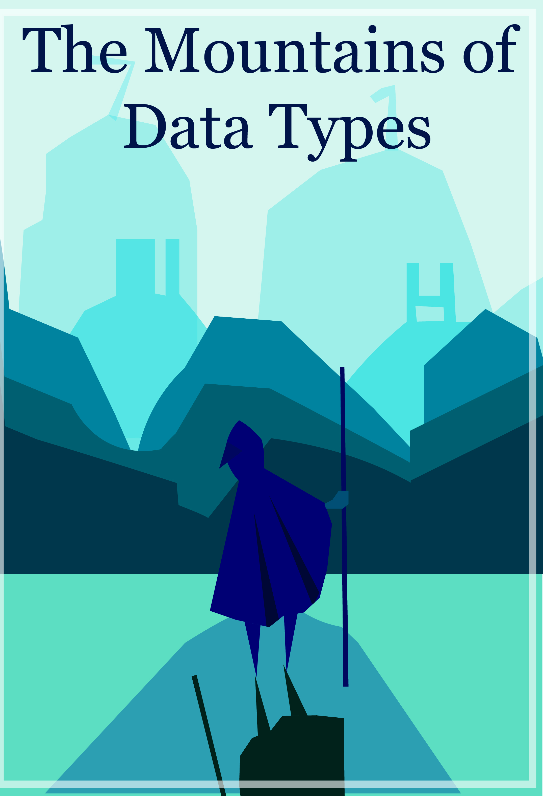
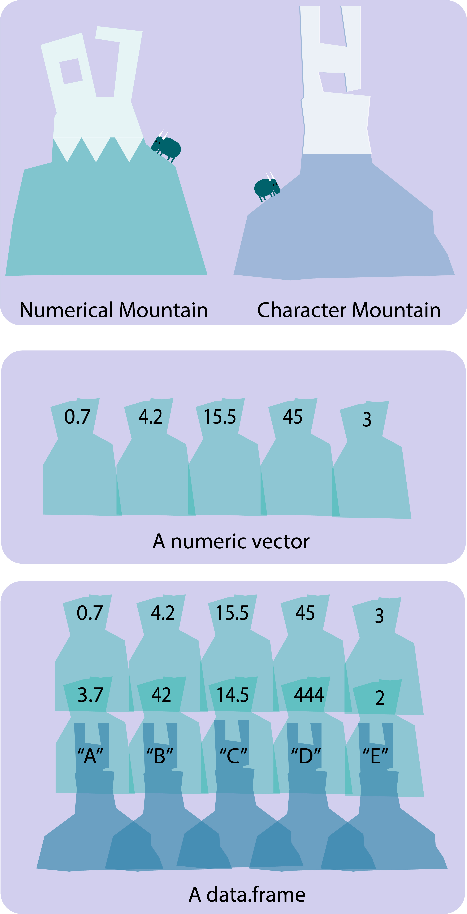
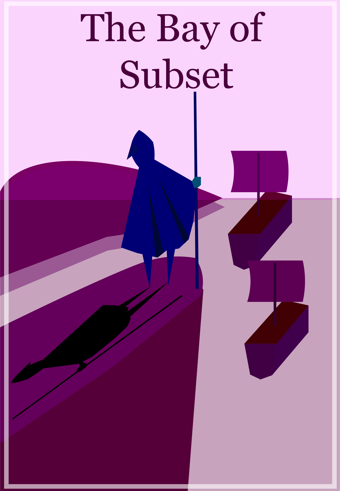
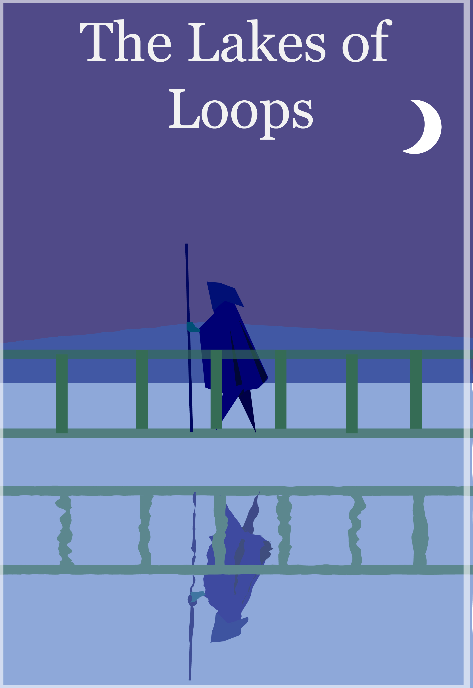
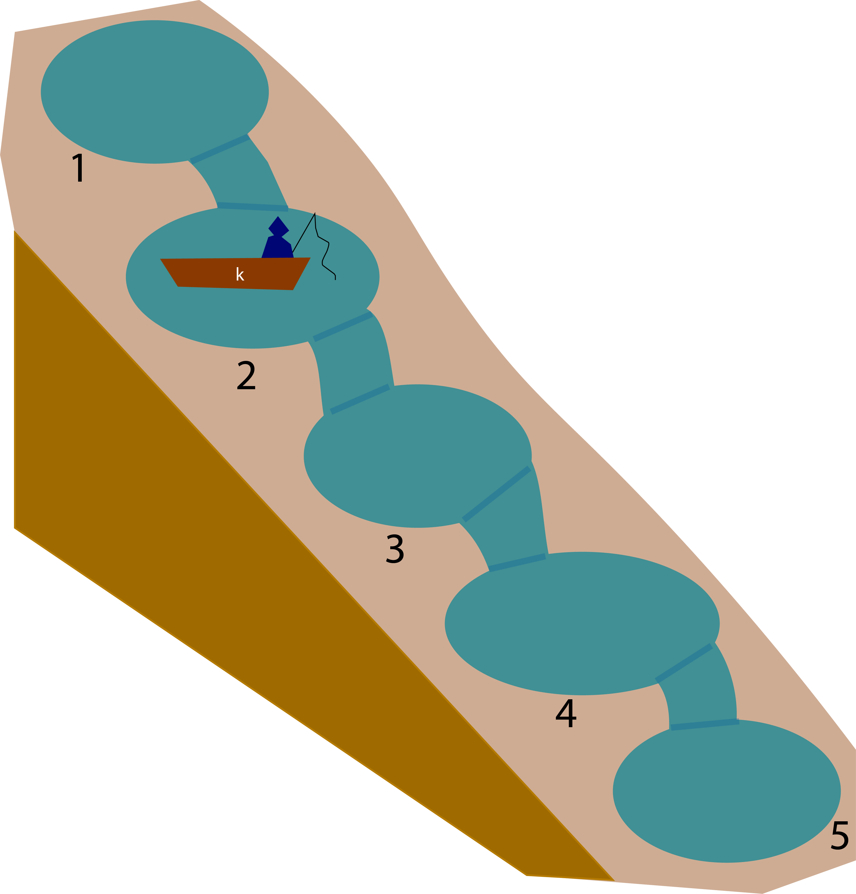

## Welcome

```{r setup, include=FALSE}
library(learnr)
library(reshape2)
knitr::opts_chunk$set(echo = FALSE)

```

Ho, esteemed traveler, welcome to the land of NewbR. Even if you do not speak our language, fret not, for we shall teach you the basics. Our fair kingdom is split into different provinces and you shall travel by the main road.

Below is the map of your journey and you will start at the *Steppes of Arithmetic* and help count the wild horses. Next, you will climb the *Mountains of Data-Types* and admire the mountain view. Then the *Bay of Subset* waits for you and you can view our numerous ships carrying the cargo to foreign shores. Traverse through the *Infinite Lake of Loops* and reflect upon your arduous journey so far. The final leg of your journey is through the *Free cities of Data-Wrangling* with each merchant prince tempting you with their fine meals.

With this basic grasp of the language, you should be able to explore the other kingdoms that speak the similar language.

Onward traveler. The journey will be arduous but rewarding!

<center>{width="455"}</center>

## The Steppes of Arithmetic

<center>{width="300" height="400"}</center>

> "The Steppes of Arithmetic is beautiful and a welcome start to an eic journey. The horses are numerous and they must be counted. Their bright sun-like color makes them easy to be counted. Learn the beginning language and realize that all journeys must begin with the simplest steps,"
>
> -The Scholar Lienkaemper in *My Small Equines: Friendship is Mathematical*

You finally took your first steps into the Kingdom of NewbR. It is important to remember that R is a language used heavily by the citizens of this continent (esteemed life-scientists!). Learn the language and you can travel to other kingdoms such as the *Kingdom of Statistical Analysis, The Doge of Data-Visualization, and City-Kingdoms of Mathematical Simulation*. But remember, we must make the arduous journey first.

The first province in NewbR is the *Steppes of Arithmetic*. Here, the new travelers are given the simple task of counting the wild horses that graze here. ***Do not think this beneath you traveler, for every other coding kingdoms start out as simply.***

### Addition

Traveler, you see 491 herd of horses and 337 herd of horses in the steppes. How many horses are there in total? In the language of R, it is very simple. You must have used a calculator before. It is the same. We use the addition operator . For your first tasks, try writing it down below.

```{r addition, exercise=TRUE, exercise.eval	=FALSE}

```

```{r addition-solution, include=FALSE}
491 + 337
```

### Subtraction

Hmm, it seems we have to move some horses from one herd to another. This herd is getting much too big. Traveler, we must record this. Let us say that in this herd of 453, I am removing 23 to move to another pasture. What is the final size of this remaining herd?

```{r subtraction, exercise=TRUE}

```

```{r subtraction-solution, include=FALSE}

453 - 23 
```

### Multiplication/Division

Hm, two more operators! Again, I will say it is still as simple as using a simple calculator. Let's look at multiplication. Look there, over the horizon, there are 5 herds with 42 horses each. What is the total amount of horses, traveler? (Hint: Use the multiplication operator \*)\

```{r multiplication, exercise=TRUE}

```

```{r multiplication-solution}

5*42

```

Excellent, now let us say that there are 4205 horses and they need to be split apart to 5 herds evenly. How many horses would be in these five herds? (Use division)

```{r division, exercise=TRUE}

```

```{r division-solution}
4205/5
```

Traveler! I see you are pleased! These simple arithmetic may show up when you least expect it in the future. So you must travel onward north, the language of R is not so frightening! The wild horses watch you go, each one wishing you luck in your venture.\

## The Mountain of Data Types

<center>{width="300" height="399"}</center>

> Travelers look upon the mountains with trepidation as the steep slopes mock those who wish to traverse. How can one climb us, they ask with such pride. Travelers, however, should realize that the Mountain of Data Types is a fantastical place! A province where mountains appear suddenly and disappear as quickly. Look beyond the horizon and see that the peaks of each mountain are different. Many scholars have described and named these peaks so you must learn to do the same. Conquer your fears by naming them!
>
> \- The Scholar Lienkaemper in *Are Mountains Even Real? Yes: A Short Thesis*

### Numerical and Character Data

Ah yes, this is one of the most challenging provinces that new travelers must pass through. Do not worry, it is not as horrible as one imagine. Let us start simple, our task is to understand the different type of mountains for navigating through this province.\
\
So let us imagine that these mountains represent your data. For example, we see a mountain ahead and see that there are numbers on its peaks. This is what we call a *numerical mountain* or more specifically, ***numerical data***. That means that the mountain peaks only have numbers like: 1,2,3, 4.2, 6/9, etc. *For life-scientists, these data can represent the number of moths we find in a trap, the height of a plant during an experiment, the number of eggs in a nest, and so on.*

But traveler do not be fooled, not all mountains have numeric peaks. *Not all data are considered numerical*. Look to the west and see that another mountain have arose and now its peak have alphabets. This is the ***character data*** **a**nd usually involves texts (ex: words and even complete sentences). When would you need a data like that? Well, let's imagine you have data on the species' name, then that species name cannot be expressed by numbers!

There are other mountain peaks (logical, integer, complex, etc.) but let us ignore them for now.

### Assigning a variable

Quick! Let us test your vocabulary again, traveler. There is a mountain that we need to name. Let us assign it a name and decide what kind of peak (numerical or character) it would have. In the language of R, we want to use this symbol **\<-** as a way to assign a value to a variable. Look upon this code:

```{r echo=TRUE}
mountain1 <- 5.0 

#Above, I am saying "I have a numerical variable name called mountain1 and it has the value 5.0" 

mountain2 <- "Macavity the Sly" 

#Above, I am saying I have a character variable name called mountain2 and it has the value Macavity

print(mountain1)
print(mountain2)

print(class(mountain1))
print(class(mountain2))
```

You can see that we assigned a value and name to a mountain. Do you now see a difference between a numerical data versus a character data.

**Try practicing:**

1.  First, create a variable called 'mountain3' and assign it the number 54

2.  Second, create a variable called 'mountain4' and assign it a character 'Mars"

```{r assign, exercise=TRUE}

```

```{r assign-solution}
mountain3 <- 54
mountain4 <- "Bye"
```

Wonderful, let us proceed to data-structures.

### Data-structures

#### Vector

So traveler, each mountain represents a single data-point. For example, let us say your specimen has a height of 5.3 inches. It would be represented by a numerical mountain with the number 5.3 at its peaks. However, we are always not looking at just a single data point.

\
Let's say you have multiple measurements. For example, you have different heights for different individuals. That means you have multiple numeric mountains but they are connected like a mountain range. This is a ***vector*** which is the simplest data structure in R with each data entry or **element** being the ame class. So a numerical vector would have all numerical data. A character vector would have all character data and so on.

We can create a vector by using called **c().** Anytime we want to put elements together than we would do this:

```{r echo=TRUE}
vector1 <- c(1,2,3,4,5)
vector2 <- c("dog","cat","bird")
```

Quick quiz, what kind of vector is vector1? Is it numerical or character. How about vector2?

**Let us practice:**

1.  First create a vector "vec1" which is a vector that have these numbers : 1/2, 1/4, 1/6, 1/8
2.  Second create a vector "vec2" which is a vector that have these words: "bam", "wham", "dam","spam"

```{r vector, exercise=TRUE}

```

```{r vector-solution}
vec1 <- c(1/2, 1/4, 1/6, 1/8)
vec2 <- c('bam','wham','dam','spam')
```

#### Data.Frame

What do you do if you have a collection of vectors? Then we would have something called a ***data frame***! This is the most common data-structure in the language of R and for good reason. A vector usually describes a single variable like the length of a lizard. If you want to have another variable like the weight of a lizard then you have to create another vector. Now what if want to assign a name for each lizard, that's another vector. A data frame would then contain all three vectors. For almost all statistical analyses, you're going to be working with data.frames

So think of multiple mountain ranges that are connected together:

```{r echo=TRUE}
Mountain_DF <- data.frame(name =c("Oppulence the Knowledgable Mountain","Ophelia the Mathematical Mountain","Ofgatz the Homestead Mountain","Oberdee the Aesthetical Mountain"),
                          height =c(53,32,45,52),
                          number_of_goats = c(5,4,4,6)
  
)

print(Mountain_DF)
```

So think of each column as a vector. Here's another way of thinking of data-types in R.

<center>{width="338"}</center>

I would like a data frame with this following. I would like the mountains named "Victoria" and "Victor". They have a large quantity of *cats* on the mountains as well as some *dogs*. They also have an extreme amount of *bees* on these mountains as well as a large number of *mugs.*

| Variable | Mt.Victoria | Mt. Victor |
|----------|-------------|------------|
| Cats     | 35          | 40         |
| Dogs     | 23          | 8          |
| Bees     | 1000        | 23         |
| Mugs     | 500         | 500        |

Okay use the framework in the exercise here and try it now make this into a data.frame!

```{r beemountain, exercise=TRUE}


```

*There are more data--types, but if one dwells too heavily on just one thing then they can never progress*. Go forward traveler! The mountains stand proud as they watch another traveler proceed.

## The Bay of Subset

<center>{width="300" height="400"}</center>

> "There are many ships at the Bay of Subset, ships go in and out of the bay to help deliver goods within NewbR and to other kingdoms. Each ship is specialized to carry specific goods. For example, my favorite ships are those that are specialized for carrying wine.
>
> -The Scholar Lienkaemper in *I Enjoy Big Boats and I Cannot Lie: A Memoir*

So you have overcome the mountains, now we enter the Bay of Subset. When we are looking at our data, sometimes we don't need all the data. The main purppose of subsetting is then extracting the data that we need to use. Do you remember the vector? Let us start with that .

For example, what if I want to get the third element from the vector?\

```{r echo=TRUE}
vector1 <- c(1,2,3,4)
vector1[3]
```

See how I use the braces [ ]. Note a very strange particularity with our language in that we start the counting with 1 as most other languages start with 0 . If we want the first element of a vector, we use vector1[1]. If we want the second element, we use vector1[2] so on.

Ah, but what if there are rows and columns such as in a data.frame? Tn We then need to specify the row and column because we are working in two dimensions!

Lets say we're working with this data.frame here:

```{r echo=TRUE}

ships <- data.frame(ships=c("Davide","Reb","Spuncert","Renka"),
                    cargo = c("Wine","Chacos","Bikes","Hot Sauces"),
                    number = c(110,300,100,234))

```

If I want to get the third row, I would use this here

```{r echo=TRUE,results='markup'}
ships[3,]
```

Remember, when we re subsetting a dataframe, the bracket [] requires us to indicate the row first and column second. Now, we're looking at the third row and keeping the column entry empty telling R we're interested in all the columns. *Remember the comma!*

Now if I wanted to extract the second column (with all the rows) then I would write it like this.

```{r echo=TRUE,results='markup'}
ships[,2]
```

Now if I want an element in the data.frame such as the third row and the third column then we would designate it like this below.

```{r echo=TRUE,results='markup'}
ships[3,3]
```

Aha! Isn't that interesting? We have found a way to choose specific entries from our data.frame! Now you do the same thing, here is a data.frame and you need to subset

1.  Extract the 1st column from the data frame above.

```{r 1column, exercise=TRUE}

```

```{r 1column-solution}
ships[,1]
```

2.  Extract the element in the third row and the second column.

```{r 3row2col, exercise=TRUE}

```

```{r 3row2col-solution}
ships[3,2]
```

### Subset

Now traveler, let me teach you a very useful function. What if we have a huge-data-frame and we want to extract entries based on certain conditions? For example, let us say that we have a data frame described what we have stored in the warehouses. We want to know which warehouses have more than 10 wine-casks. We can do that with the subset function.

```{r echo=TRUE}
wine <- data.frame(warehouses = c("warehouse1","warehouse2",'warehouse3','warehouse4','warehouse5'), 
                   wine_casks = c(30,2,4,5,15))


print(subset(wine, wine$wine_casks > 10 ))

```

We see that Warehouse 1 and Warehouse 5 are abundant in win!.

Subset can do this with more variables. Let us say we store cheese wheels in these warehouses and we are interested in *warehouses that have more than 10 wine-casks and 15 cheese-wheels*.

```{r}
wine_cheese <- data.frame(warehouses = c("warehouse1","warehouse2",'warehouse3','warehouse4','warehouse5'), 
                   wine_casks = c(30,2,4,5,15),
                   cheese_wheels = c(9,34,40,40,50))


print(subset(wine_cheese, wine_cheese$wine_casks > 10 & wine_cheese$cheese_wheels > 15))
```

We see that only one warehouse fits our criteria.

Let us do some exercises. Here are ship companies and I would like to see you use the subset function.

```{r}
ship_company <- data.frame(company=c("Bart","Lisa","Maggie","Homer","Marge"),
                    ships= c(500,54,66,700,65),
                    sailor = c(60,300,900,34,76),
                    beer = c(53,66,67,9,40),
                    hardtack = c(60,70,70,100,60))
```

1.  What company seem to have more than 700 sailors?

```{r 200sailors, exercise=TRUE}

```

```{r 200sailors-solution}
Maggie
```

2.  What company have more than 300 ships AND 10 beer?

```{r 300ships, exercise=TRUE}

```

```{r 300ships-solution}
Bart
```

3.  What companies have more than 90 hardtacks?

```{r 90hardtack, exercise=TRUE}

```

```{r 90hardtack-solution}
Homer
```

## The Infinite Lake of Loops

<center>{width="300" height="400"}</center>

> We call this the Lakes of Infinite loops. There are many lakes. They seem to loop around to each other. Some criticize our kingdom for having the looping lakes but we like their simple beauty and the travelers learn from their reflections here!
>
> > -The Scholar Lienkaemper in *Lakes, Lakes, Lakes, and More Lakes*

Imagine a task where you have to do something 1000 times. Wouldn't there be a better way of automateingthis? We would use something called 'for-loops'! All computer languages use 'for loops' and for life-scientists, you will use his to make multiple plots, run the same analysis on multiple data.frames, and so on.

Let me show you the code for looping, remember that you need the framework here. The k can be replaced with the letter i, j, or whatever you desires. This is a variable specifically meant for counting how many times you have looped so far.

```{r}
for (k in seq(1,5)){
 
   print(paste0("Fishing here in lake"," ",k))
}
```

Let me show you a diagram of how to think about loops. Imagine that there are five lakes that are connected to each other and your task is to catch a fish within each pond. I give you a little canoe which we call the magical looping canoe 'k' and it serves as your guide to know where you are in the series of lakes.

If **k =1**, that means you're in **Lake 1**. When you're done fishing in **Lake 1**, that the magic canoe takes you automatically to Lake 2 where k is now equal to 2. And this magical canoe automatically takes you to the next lake without you having to directly command it! But it is very important you tell the canoe how many lakes you will like to traverse!

{width="357"}

So when are for-loops useful? Well, anytime you are running the same function multile times. Though when you are far more skilled at speaking the R language, some would suggest that you use the "apply" function as it's faster. However, for loops is great to learn because it is a useful, nifty tool!

Say we have this problem. On your magical canoe, I would like you, traveler, to add more fishes to each of the lake. Specifically, here are the instructions provided by the magistrate

> To our esteemed guest
>
> Please deposit "3 fishes" to the current fish population in the lakes of the Western Region. Please record the total number of fishes after you have added them in.
>
> The Thankful Magistrate\

Traveler, there are 7 lakes connected together in the Western Region! Here are the current number of fishes from the census.

| Lake | Number of fishes |
|------|------------------|
| 1    | 40               |
| 2    | 22               |
| 3    | 31               |
| 4    | 140              |
| 5    | 2                |
| 6    | 9                |
| 7    | 5                |

```{r num_fish}

Curr_Num_Fish <- c(40,22,31,140,2,9,5)


```

Now remember the structure of the for loop and fill this is in!

```{r num_fish2, exercise=TRUE}
for(l in seq(1,__)){
  
  print(Curr_Num_Fish[[l]] + ___)
  
}

```

```{r num_fish2-solution}
for(l in seq(1,7)){
  
  print(Curr_Num_Fish[[l]] +3)
  
}
```

This is the simplest thing we can do with for-loops. Remember your lessons here and let us proceed to the The Free Cities.

## The Free Cities of Data Wrangling

<center>{width="300" height="400"}</center>

> The majority of the proud citizens live in the cities! Here, data is shaped, organized, and polished by these wondrous crafters. There are, however, many cities and guilds with different philosophies and thoughts of how to wrangle your data.
>
> -The Scholar Lienkaemper in *Urban Life*

Ah, the last destination before the journey ends for now. This is a huge province and there are many cities and there are many guilds. We shall stick to three cities but note that there are many, many cities with their own data-wrangling artists. In your journey, you may come to a city and find it more agreeable than others. I shall introduce you to an important city: ***merge.***

### Merge

Now finally, we have come to the last city in our journey and that is the function **merge**. Sometimes you will have two data.frames that you need to merge together. For example, let us say you have data about birds and you recorded the size of the bird (let's say in feet, these are very big birds!)

| Bird Name | Size |
|-----------|------|
| John      | 5    |
| Jack      | 6    |
| Joe       | 7    |

The next day you recorded the color of the bird and

| Bird Name | Color |
|-----------|-------|
| John      | Black |
| Jack      | White |
| Joe       | Green |

Now you want to merge the data frames together, in other words you want an end result that looks like this

| Bird Name | Size | Color |
|-----------|------|-------|
| John      | 5    | Black |
| Jack      | 6    | White |
| Joe       | 7    | Green |

To do this, we use the merge function and the simplest way to use it is with:

> merge(dataframe A, dataframe B, by = the common variable name)

```{r}
birdA <- data.frame(name=c("John","Jack","Joe"),
                    size=c(5,6,7))

birdB <- data.frame(name=c("John","Jack","Joe"),
                    size=c("Black","White","Green"))

birdAB <- merge(birdA,birdB ,by="name")

print(birdAB)
```

## Conclusion

Congratulations, traveler! You have arrived to the end of the journey and you are now at the cross road to many different kingdoms. You have grasped the very basic of the R language and there are many

## About/Changes

Hi I'm Damie Pak (\@pakdamie), I'm a postdoc at Cornell University . This is still WIP as I want to add more art and topics. I got inspired by the videogame **Journey** and the book **"The Barrel of Laugh, The Vale of Tears"**.

Please email me at dp495\@cornell.edu for suggestions or any errors/typos.

**Changes**

1.0 - Hello! This program is born!
